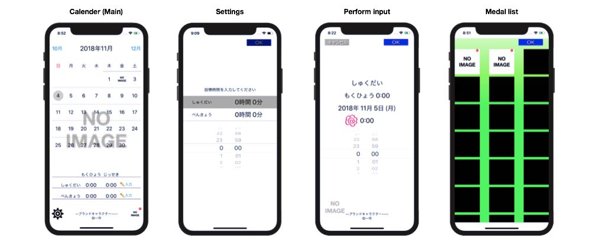

# RecordStudy for iOS

It is an iOS application that records the time you studied.

*Read this in other languages: [English](README.md), [日本語](README.ja.md).*

# Getting Started
1. Download the Xcode 9 release.
2. Clone this repository.
3. Run to ``pod install`` install dependencies.

